.. MintSD documentation master file, created by
   sphinx-quickstart on Tue Aug 11 12:08:46 2020.
   You can adapt this file completely to your liking, but it should at least
   contain the root `toctree` directive.

INTRODUCTION
============

.. toctree::
   :maxdepth: 2

Thank you for choosing **Mint Service Desk**.

The present document is the main reference for **MINT Service Desk**
users, the purpose of the document is to explain all the functionalities
and configurations available in **MINT Service Desk**. This guide
includes the customer, agent, and administrator interfaces along with
all the configurations and changes that you can do in the system.

MINT SERVICE DESK 2.0.3
-----------------

**MINT Service Desk** is a service management solution to monitor,
track, and exchange information about resources within your company and
with outside vendors.

**MINT Service Desk** is a web-based application for service management,
it is a multi-channel system that allows you to support your customers
(internal or external) based on the service request they will send via
email, portal, or any other communication channel supported by MINT
Service Desk. A user-friendly ticketing system with a lot of integrated
features from a fresh point of view.

The roadmap for **MINT Service Desk** includes new functionalities and
ITSM features that are being developed and tested now, like:

-  Service Desk and Ticketing System

-  Asset Management

-  Incident Management

-  Problem Management

-  Multichannel Communication

-  Process Management

-  IoT Asset Management

-  Knowledge Management

-  Reporting

PROFESSIONAL SERVICES
---------------------

**OPGK Software** is the owner and developer of the **MINT Service
Desk**, we provide professional services to our customers to implement
our software successfully.

Our catalog includes consulting, training, development, and managed
cloud services. We also have a Partnership program and special programs
for educational and non-profitable organizations.

Visit us at `mindsd.com <http://www.mintsd.com>`__ or send us an email
to info@opgksoftware.com thanks!

INSTALLATION
============

SYSTEM REQUIREMENTS
-------------------

**Mint Service Desk** runs in **Docker** (a computer program that
performs operating-system-level virtualization, which means that a
virtual machine will be deployed in your server in order to have your
**MINT Service Desk** up and running. The **MINT Service Desk**
installation file for Docker includes an application, database, and web
server embedded to deploy **MINT Service Desk**.

In order to install **MINT Service Desk**, the minimal server
requirements are:

HARDWARE
~~~~~~~~

**MINIMAL SERVER REQUIREMENTS**

CPU: Intel Xeon 2.0 GHz or equivalent

RAM: 8 GB

Disk space: 100GB

SOFTWARE
~~~~~~~~

**SUPPORTED SYSTEMS AND VERSIONS**

**Operating Systems:**

Linux (all distributions supported by Docker)

**Database (embedded):**

PostgreSQL

**Web browser:**

Chrome

Firefox

Safari

GETTING STARTED
---------------

The following instructions will help you to install and setup the **MINT
Service Desk** in your server.

DOWNLOADING MINT
~~~~~~~~~~~~~~~~

First, you need to download the latest version of Mint Service Desk. You
can do it on the following address
https://www.mintsd.com/pages/download-center by clicking the “Download”
button.

|image0|

Save the file on your hard drive.

INSTALLATION ON LINUX OS.
~~~~~~~~~~~~~~~~~~~~~~~~~

The following Installation guide was prepared based on the CentOS
distribution of the Linux system.

Open up the **Command-Line**. Now, you need to move the file, that you
downloaded a moment ago, to */opt* folder from your computer to the
server. Use the following command.

    scp mint-service-desk-2.0.7.sip ssh root@\ **YORSERVERIP**:/opt

|image1|

If you downloaded a newer (than 2.0.7) version of the system you need to
change the name of the file in that command. Also, replace
“YOURSERVERIP” with your server IP.

Now type the *ls* command. You will see the Mint Service Desk .zip file.

|image2|

**Installing Docker**

As mentioned before, **Mint Service Desk** runs in **Docker**. The
following instructions will help you to install and setup the MINT
Service Desk in your server. Take notice that those instructions were
made for Docker v19.03 and Docker Compose v1.25.5. In case of a version
change, you will also need to change it in some steps (commands).

Please check the following links to setup Docker in your MINT SD server.
Under each link, you will find the detailed instruction of how to
install Docker (if you like to do it by yourself). Remember, that first,
you need to create an account (DockerID) in order to be able to download
Docker.

-  `Docker for
   CentOS <https://docs.docker.com/engine/install/centos/>`__

-  `Docker for
   Ubuntu <https://docs.docker.com/engine/install/ubuntu/>`__

-  `Docker for
   Debian <https://docs.docker.com/engine/install/debian/>`__

-  `Docker for
   Fedora <https://docs.docker.com/engine/install/fedora/>`__

Once you downloaded Docker you can go back to **Command-Line.** Type the
following command.

    sudo yum install -y yum-utils

|image3|

Wait until the installation is finished.

|image4|

This has installed the yum-utils package (which provides the
yum-config-manager utility) and set up the stable repository.

Now type the following command:

    sudo yum-config-manager \\

    --add-repo \\

    https://download.docker.com/linux/centos/docker-ce.repo

If everything went fine you should see the following information

|image5|

**Installing Docker Engine**

Now, you need to install the latest version of the Docker Engine and
container. Type the following command in Command-Line.

    sudo yum install docker-ce docker-ce-cli containerd.io

After a while, you will be asked to confirm the installation. Type “y”
for yes.

|image6|

Wait a moment and you will be asked for confirmation one more time. Type
“y” for yes.

|image7|

The installation process can take a while. Once it is finished you
should see the following information.

|image8|

**Starting Docker**

Once the Docker has been installed we can start it. Type the following
command in the Command line

    sudo systemctl start docker

**Installing Docker Compose**

Docker Compose is needed for the Mint Service Desk installation. In
Linux OS you have to manually install it (depending on your Linux
distribution this can change) by running the following command.

    sudo curl -L
    "https://github.com/docker/compose/releases/download/1.25.5/docker-compose-$(uname
    -s)-$(uname -m)" -o /usr/local/bin/docker-compose

After a moment installation will be completed.

|image9|

Now you need to apply executable permissions to the binary. Use the
following command.

    sudo chmod +x /usr/local/bin/docker-compose

Now you should test the installation. Run the following command.

    docker-compose --version

You should receive the following information.

|image10|

**Extracting the MINT package.**

Before you can proceed to the next step you need to extract the content
of the Mint package you have downloaded at the very beginning of this
guide.

Run the following command in the Command-Line.

    yum install unzip

After a moment you will be asked for confirmation. Type “y” for yes.

|image11|

After a moment the process will finish.

Now let’s extract the files from the Mint package. Use the following
command.

    unzip mint-service-desk-2.0.7.zip -d /opt/mintsd

The process will only take seconds to complete.

Now, type *ls* command and you should see the following information.

|image12|

Now, change the location to ‘mintsd’ catalog. Use the following
commands.

    cd mintsd

then

    ls

You should see the following information.

|image13|

**Installing MINT**

Once the package has been extracted you need to run the start script.
Use the following command.

./start.sh

Now just follow a couple of steps described in the next sections until
the end to complete the installation.

At the beginning, you will be asked to read and agree with the License
Agreement. Type “y” if you accept them.

|image14|

Once the install files has been checked you can proceed.

First, you need to enter the domain address. By default it is
“localhost’. Change it to your server’s IP or FQDN (Fully Qualified
Domain Name).

|image15|

Let’s use 192.168.100.30 as an example.

|image16|

Now, enter Mint Service Desk system name. By default, it is “MintSD”.
Change it to the desired one.

|image17|

Now you can either set up the passwords for ‘RabbitMQ’ and for Database
or leave the default ones.

|image18|

Once you click enter you will have to wait a while until the process of
configuration of docker environment, docker images, loading layers, and
couple more things is finished.

If everything went fine you should see the following information.

|image19|

At this moment, you should stop and wait for a couple of minutes,
because the services are starting for the first time.

**Everything is ready!** You can now move to your web browser and access
mint.

FIRST LOGIN
-----------

Type your server IP on your web browser and login with the default admin
account credentials (remember to change it):

Login: **admin** Password: **admin1**

|image20|

Now, in order to start using Mint Service Desk you need to:

1. Define a new email account from which messages will be sent. You can
   do it in section Channels > Accounts. Right here you need to click on
   the small |image21| button located on the right side of the search
   bar.

|image22|

Inside the “Create Account” view you will need to fill up the required
information (fields marked with a \*). Also, you can add some additional
information inside the “Description” text field.

|image23|

    Once you do that, click on the |image24| button to proceed.

    Now, in the next view, you will need to fill up some technical
    information.

|image25|

Once you finish, click on the |image26| button to finish the process and
save the new email account.

You will be moved to the list of existing accounts, where you will see a
new position with some information about your new email account.

1. Define at least one “Body” type template component which includes at
   least ‘{{EmailURL]}}’.

   You can do it in section Channels > Components.

   Right here you need to click on the small |image27| button located on
   the right side of the search bar.

|image28|

In the view responsible for creating a new template component click the
right mouse button in the ‘Description’ section and from the menu select
Email > Url.

|image29|

Click on the |image30| button.

1. Define at least one template. You can do it in Channels > Templates
   section.

   Right here you need to click on the small |image31| button located on
   the right side of the search bar.

|image32|

You need to choose a previously created Body type Component from the
list in the ‘Select body’ section. Also, remember to create an
appropriate name for this template and select “system” from the
“Template type” part of this view.

|image33|

Click on the |image34| button.

1. Now you need to Set up ‘Email confirmation Template’. You can do it
   in the Settings section by clicking on ’Templates’ and choosing
   already created template from the list in the ‘Email confirmation
   template’ section.

|image35|

Once you do that, just click on the |image36| button.

1. Now you need to create at least one Agent type user. You can do it
   Users > User Manager section. Right here you need to click on the
   small |image37| button located on the right side of the search bar.

|image38|

Inside, in the ‘Create User’ view, you need to fill up all of the
required information and click on the |image39| button once you do that.
Take notice, that you need to select a correct ‘Role’ from the list.

|image40|

    MINT Service Desk has one already predefined Agent role. If you want
    to learn more about adding and managing system Roles, you will find
    more information in the Admin part of this guide.

1. Once Agent is created, the first attempt to login will send a
   verification email to the new Agent on his email address (given
   during the previous step). It will include a request to validate his
   email address.

   Once that’s done – you are ready to go.

UPGRADING
---------

If you have a previous version of **MINT Service Desk** and you want to
upgrade your system to the latest version, you can do it as follows.

First, you need to download the latest version of MINT Service Desk
here:

https://mintsd.com/products/mint-service-desk-free

Then you just need to extract the package downloaded and run the start
file as you did during the installation process:

on Linux/OSX:

./start.sh

on Windows:

./start.cmd

You are not going to go through all the same steps again like in the
installation, the system will only apply the changes and upgrades needed
from the previous version and it will keep your data safe.

WEB INTERFACE
=============

LOGIN PORTAL
------------

The Mint Web Client URL leads you to the login portal, to ease the user
management, all the users can log in in the same page and the system
will open the proper session based on the assigned role.

**Mint Service Desk** works with three different user profiles:

-  Customer

-  Agent

-  Admin

SIGN IN
~~~~~~~

It is the main displayed screen. If you already have an account, just
type your username and your password in the corresponding fields and
click on |image41|. If you want, you can check the option “Remember My
Login”.

|image42|

FORGOT MY PASSWORD
~~~~~~~~~~~~~~~~~~

If you forgot your password you just need to click on the |image43| link
that will forward you to a new screen where you need to type your email
address in order to receive a new temporary password. Don’t forget to
change it to something you will remember easily but remember that
password should also be safe and hard to crack.

|image44|

SIGN UP
~~~~~~~

If you don’t have an account, the |image45| button (on the right upper
corner) will take you to a predefined form, where you have to type your
personal information: “USERNAME”, “EMAIL”, “FIRST NAME”, “LAST NAME” and
“PASSWORD”, in order to create your account. The **MINT Service Desk**
admin will receive your request, activate your account and assign you a
correct Role - so you would be able to log in.

|image46|

BASICS
------

All users have the same section to change their profile settings, after
a successful login. You will find an action bar on the top, including
the |image47| button to hide/show the bar on the left, the new ticket
|image48| action button and the profile |image49| .

|image50|

On the top right corner, you will see a picture or letters from your
profile. In order to edit your profile or logout, you need to click on
the circle |image51| .

It will display a menu with two options: “Profile” and “Log out”.

PROFILE
~~~~~~~

If you click on “Profile” it will lead you to the section where you can
change your personal data, like “Picture” (by clicking on the box),
“Language”, “First Name”. “Second Name”, “Surname” and “Password”. Also,
you can select what kind of notifications you’re interested in
receiving: ‘System alerts’, ‘Push’, ‘email’ or ‘mention’.

The last option of those options means that when you select it you will
receive an notification each time an Agent mentioned you in any places.
Also other Agent will receive such notification when you mention him.

Please notice that it is not possible to change the “Email” or “Login”,
only the administrator can change the “Email”.

On the right side of the screen, you will also see some custom created
fields with additional information. Those fields can be created and
managed in Admin > Users > Schema Creator – it will be explained later
in this guide.

|image52|

After making your changes you have to click on the |image53| button to
store your changes, also if you want to leave this section, the system
will ask you if you want to save changes before leaving.

|image54|

SIGN OUT
~~~~~~~~

If you want to log out and close your session on **MINT Service Desk**,
just click on “Sign out” and the system will close your session and lead
you to the main login screen.

|image55|

CLIENT PORTAL
-------------

The client portal is a user-friendly interface where clients can see
their tickets, create new tickets, and check the list of available
assets.

DASHBOARD
~~~~~~~~~

The first screen after login is “Dashboard”. It displays the tickets
that the client is able to see, those can be “My tickets” or tickets
from the same company created by another colleague.

|image56|

You can filter the tickets listed by ‘Queues’, ‘Ticket type’, ‘Status’
and ‘Period’, or choose to sort tickets by different attributes like
“Ticket Number”, “Subject”, “Creation date” and more.

The attribute columns can be added or removed in the section “Set column
properties” on the right side by clicking on the |image57| button. Once
you do that you will see a small window, where you can select the
desired information you want to see on the tickets list. Making any
changes in ‘Set column properties’ is automatically saved, so you won’t
lose anything once you go to any other part of the system. You can also
click on most of the columns in order to sort the list by desired
attribute (like ‘Creation date’ or ‘Subject’).

|image58|

Also, you can look for specific tickets using the section “Search”
field. Whatever you type here will be searched for, depending on the
things you marked in the ‘Search by’ section of the ‘Set column
properties’ window.

|image59|

In the upper part, above the tickets list, you will see a |image60|
button, which will allow you to reset the view and remove all of the
active filters.

If you want, you can export the list of your tickets and save in one of
two file formats: .CVS or .XLSX. To do that, just click on the |image61|
button and select one of the 2 available file formats. Now, in the new
window click ‘Save’ to save the file in your browser’s default download
catalog.

Once you open the file it will contain tickets information such as:
‘Ticket number’, ‘Id’, Subject’, Creation date’, ‘Last modification’,
‘Company’, ‘Status’, Customer’, ‘Queue’, and ‘Assignee’.

If you like to see or hide tickets that have already been solved and
closed, you can always mark/unmark the option |image62| located on the
right side of the Dashboard screen.

When you have plenty of Tickets on the list, you will have to use some
additional navigation options, located below the list of Tickets, for
moving between pages or for changing the number of Tickets that can be
displayed on one page.

|image63|

On the left side, you have the navigation buttons, while on the right
side you can change the number of tickets per page. Those options are
available in many places in Mint Service Desk.

One more important thing is that you can click on any attribute of the
listed tickets on your dashboard and that will take you to the “Ticket
Details” of the selected ticket.

TICKET DETAILS
~~~~~~~~~~~~~~

You will find the communication and the details of the ticket in this
section.

|image64|

All of the information about “Ticket number”, “Customer”, “Company”,
“Status”, “Queue”, “Assets”,” Ticket type”, “Priority”, “Service”, “Age”
and “Channel” are located on the right side in ‘Details’ section.

Take notice that the attribute “Assets” also includes a search option
that you can use to look for a specific asset very quickly and link it
with the ticket.

Below the ‘Details’ section, you will find some additional
attributes/information. They can be created and managed by the Admin
user in Admin > Tickets > Schema Creator – it will be all explained
later in this guide.

|image65|

The messages and details of the communication are in the middle.
Messages can be displayed in chat view or framed by selecting one of
them |image66| .

If the message contains a lot of text it will we shortened – in order to
see the whole text you need to click |image67| .

You can type your message in the text box and send it by clicking on
|image68| button.

You can also use the |image69| section to compose a larger message and
change the font, size, format as well as add some attachments.

|image70|

While typing a new message you can also ‘mention’ someone e.g. other
Agent or client himself. If the agents select the ‘mention’ option in
his user profile setting (‘notifications’ part) he will receive a
notification.

To mention someone just type ‘@’ and start typing the name/username of a
person you want to mention.

|image71|

Now click the |image72| button and the message will be sent and you will
see in on the chat.

|image73|

One last thing is that you can ‘Subscribe’ the ticket by clicking on
|image74| icon. You will receive a notification each time something new
happens within the ticket.

If, by any means, you want to close the ticket, as a Client you can do
this by clicking on the |image75| button located in the top right corner
of the ‘Details’ section. Once you do that a new message will appear in
the chat section.

|image76|

Basically, the ‘Ticket Details’ section is where you will see all of the
interactions between customers and agents happening in order to solve
the ticket.

ASSETS
~~~~~~

As a customer, you will also see the “Assets” section, where you will
find the assets available from the company or provider. This means that
the **MINT Service Desk** administrator added some assets that are not
assigned to you, but they are available or connected because maybe you
can relate your requests with them or you can ask for new services
knowing that the asset is available in the company.

As an example, it is very helpful for software assets because you will
know if your company already has a particular software or license you
may need, and you don’t need to pay twice.

|image77|

Right here you can filter those assets by ‘Categories’ or by ‘Period’.
If you want to reset active filters, just click on the |image78| button.
You can also remove any selections (Categories, Filters, Attributes
chose values) by click on |image79|\ or |image80| button right next to
each position.

The attribute columns can be added or removed in the section “Set column
properties” on the right side by clicking on the |image81| button. Once
you do that you will see a small window, where you can select the
desired information you want to see on the assets list. Making any
changes in ‘Set column properties’ is automatically saved, so you won’t
lose anything once you go to any other part of the system.

|image82|

Also, you can look for a specific assets by using the section “Search”
field. Whatever you type here will be searched for, depending on the
things you marked in the ‘Search by’ section of the ‘Set column
properties’ window.

|image83|

If you want to see the details of any asset, just click on one of them
or use |image84| button, and the system will move you to an ‘Edit Asset”
screen which displays information and Asset’s attributes.

Remember, that there might be more attributes for that asset in the
system, but you will be able to see only those which Admin user wants to
display.

|image85|

Also, if by any means necessary, you will be granted the rights and
privileges to make any changes inside the asset, in this place you will
be able to do it.

ACTIVITIES
~~~~~~~~~~

On the left side, in the lower part of the menu, you will find the
Activities section. It will display the customer tickets with any new
activity, so the customer can easily see what is new and go directly to
the action. You will see a blinking ticket on the list each time a new
change, like a new answer from the Agent, has been made.

|image86|

If you like, you can delete any position from the Activities list, by
clicking the |image87| button, which will appear the moment you move
your mouse cursor over any activity.

If you have plenty of positions available on the Activities list, it
will be divided into pages. To move between them you need to use a
|image88| navigation option.

NEW TICKET
~~~~~~~~~~

On the top right side of the Dashboard screen, you will find two
shortcut icons: |image89| and |image90| for “Create New Ticket”. Click
on one of them and the new ‘Create new ticket” screen will be displayed.

|image91|

Right here, you will need to fill up some required (marked with a \*)
information such as “Subject” (a short description of your incident or
request), “Description” (detailed information about the problem, your
need, etc.) and also choose a right ‘Ticket type’ and assign the ticket
to a right queue by selecting one on the ‘Assign to queue’ list.

Apart from the above you can also choose a ‘Service’ (along with
SLA/parameters/priorities which are specified individually for each
service), add some attachments (pictures, screenshots, etc.), and select
a ‘Priority’ of your ticket.

If you chose a ‘Ticket type’ which includes some additional attributes,
you will see, that on the right side of a screen a new block has
appeared, containing some fields and other options, where you can add
even more information.

|image92|

Now, once you’re done with everything, just click on the |image93|
button (right bottom corner) to create your new ticket and wait for
Agent’s response.

As you probably noticed, immediately after creating a ticket you have
received an automated response message from MintSD Assistant. Those
messages can be created and managed by the Admin user – it will be
explained later in this guide.

|image94|

Last, but now least, if you ever see the following message, while trying
to access any Ticket or Asset, it means that the Admin user has changes
your access rights and you need to contact him and ask for help.

|image95|

AGENT PORTAL
------------

DASHBOARD
~~~~~~~~~

Once you login to your Agent account you will see a Dashboard view.

|image96|

It will display the tickets that you are able to see based on the agent
rights. You can sort them by different attributes (by clicking on the
column name) and also on the left side you can filter your tickets by
“Queue”, “Ticket Type” or you can use the “Filter by” option that helps
you to filter them by “Status”, “Agent”, “Company” and “Period”.

The attribute columns can be added or removed in the section “Set column
properties” on the right side by clicking on the |image97| button. Once
you do that you will see a small window, where you can select the
desired information you want to see on the tickets list. Making any
changes in ‘Set column properties’ is automatically saved, so you won’t
lose anything once you go to any other part of the system.

|image98|

Also, you can look for specific tickets using the section “Search”
field. Whatever you type here will be searched for, depending on the
things you marked in the ‘Search by’ section of the ‘Set column
properties’ window.

|image99|

In the upper part, above the tickets list, you will see a |image100|
button, which will allow you to reset the view and remove all of the
active filters.

If you want, you can export the list of your tickets and save in one of
two file formats: .CVS or. To do that, just click on the |image101|
button and select one of the 2 available file formats. Now, in the new
window click ‘Save’ to save the file in your browser’s default download
catalog.

Once you open the file it will contain tickets information such as:
‘Ticket number’, ‘Id’, Subject’, Creation date’, ‘Last modification’,
‘Company’, ‘Status’, Customer’, ‘Queue’, and ‘Assignee’.

If you like to see or hide tickets that have already been solved and
closed, you can always mark/unmark the option |image102| located on the
right side of the Dashboard screen.

When you have plenty of Assets on the list, you will have to use some
additional navigation options, located below the list of Assets, for
moving between pages or for changing the number of Assets that can be
displayed on one page.

|image103|

On the left side, you have the navigation buttons, while on the right
side you can change the number of Assets per page. Those options are
available in many places in the Mint Service Desk.

One more important thing is that you can click on any attribute of the
listed tickets on your dashboard and that will take you to the “Ticket
Details” of the selected ticket.

NEW TICKET
~~~~~~~~~~

If an Agent receives a phone call from a customer or if he wants to
create an internal ticket, then he needs to create a new ticket. In all
cases, the agent needs to click on one of two buttons: |image104| or
|image105| , located on the top right side of Client Portal.

A new ‘Create new ticket’ screen will be displayed.

|image106|

When an agent receives, for example, information that some Customer has
a problem but did not or (by any means) cannot create a Ticket, an Agent
can, while creating a ticket, assign ‘Company’ and a ‘Customer’ to the
ticket.

|image107|

In this place, an Agent cal also quickly add a new Company and user by
clicking on the |image108| button. Depending on the choice he will see
one of two following windows.

|image109|\ |image110|

Once an agent chooses a Company and/or Customer additional information
will appear on the right side.

|image111|

Now, the agent needs to add some required (marked with a \*) information
such as “Subject” (a short description of your incident or request),
“Description” (detailed information about the problem, your need, etc.)
and also choose a right ‘Ticket type’ and assign the ticket to a right
queue by selecting one on the ‘Assign to queue’ list.

Apart from the above Agent can also choose a ‘Service’ (along with
SLA/parameters/priorities which are specified individually for each
service), add some attachments (pictures, screenshots, etc.) and select
a ‘Priority’ of his ticket.

If an Agent chooses a ‘Ticket type’ which includes some additional
attributes, he will see, that on the right side of a screen a new block
has appeared (located below the ‘Company Details and/or ‘Customer
Details’ parts), containing some fields and other options, where he can
add even more information to his ticket.

|image112|

Now, once an Agent has completed filling up the information, he needs to
click on the |image113| button (right bottom corner) to create his new
ticket.

TICKET DETAILS
~~~~~~~~~~~~~~

As mentioned before, from the ‘Dashboard’ view, as an Agent you can
click on any of the tickets on the list in order to move to the ‘Ticket
Details’ part of the system.

|image114|

Right here, all of the Ticket Details will be presented on the right
side. Those are: “Ticket number”, “Customer” (by clicking the |image115|
icon you will be able to change/add a Company or Customer), “Company”,
“Status”, “Assignee”, “Queue”, “Related to”, “Assets”, ” Ticket type”,
“Priority”, “Service”, “Age” and “Channel”.

Take notice, that as an Agent you are able (unlike the Customer) to
change most of the details. Just like the Client, you can add specific
assets to your ticket, but also relate this ticket with any other, if
the problem is similar to previously reported.

|image116|

If you click on a magnifier icon, next to any of those two positions,
you will see a new window, where you can either search for an asset or a
ticket you want to add (asset) or relate (ticket) with your problem.
Below you can see the look of the window, where you can search for an
asset to add to your ticket.

|image117|

Searching for a ticket, you want to relate to yours, looks very similar.
The only difference is that you can filter them by Queue or Ticket Type
(while for the assets you use Categories).

Below the ‘Details’ section, you will find the ‘SLA timeline’ section
showing interactive counters (with progression bars) with time left for
e.g. responding to the client or for resolution of a problem. Those
timers are refreshed each second and progression bars are filling up.
Once any of them is full (or close), the right person (depending on
Admin choices made in Services section) will receive a notification.

|image118|

Below the ‘SLA timeline’ section you will find some additional
attributes/information (depending on the Ticket Type you choose
earlier). They can be created and managed by the Admin user in Admin >
Tickets > Schema Creator – it will be all explained later in this guide.

|image119|

The messages and details of the communication are in the middle.
Messages can be displayed in chat view or framed by selecting one of
them |image120| .

If the message contains a lot of text it will we shortened – in order to
see the whole text you need to click |image121| .

You can type your message in the text box and send it by clicking on
|image122| button.

You can also use the |image123| section to compose a larger message and
change the font, size, format as well as add some attachments.

|image124|

One last thing is that you can ‘Subscribe’ the ticket by clicking on
|image125| icon. You will receive a notification each time something new
happens within the ticket.

The communication within tickets is very important. The cool thing is
that as an Agent you can check the “Private note” option (located at the
bottom) in order to send internal messages which will be visible only
for Agents and not for the Customers.

|image126|

Always remember, that if you want to send messages to the customer
**you** **need to uncheck this option,** otherwise the customer won’t be
able to see them.

The other important thing within communication is that you can add some
internal comments next to any internal message and by that to start an
“Internal discussion” with other agents in order to discuss the problem.

|image127|

Thanks to that you can keep track of the answers in one place rather
than adding new ‘private messages’ in the main chat. You won’t have to
scroll down the whole communication and look for the answers.

When you reload the view or come back to the ticket after some time, you
will notice that internal discussions are hidden. In order to see them,
you need to click on the |image128| link.

Last, but not least, a **New Ticket will always wait for someone to be
assigned to it**. If an Agent writes a message inside the Ticket chat,
he will be automatically assigned to the ticket. The other way to do it
is to click on the “Assignee” part of the “Details” section and choose
an agent from the list.

|image129|

In both cases, a new internal message will be displayed in the
communication part of the “Ticket Details’ view.

|image130|

NEW ASSET
~~~~~~~~~

On the top right side of the agent portal, the bar menu also displays
the button of the feature “New asset” that allows agents to create new
assets.

|image131|

Once you click on the icon, a new asset creation form will be displayed.
Right here, an Agent can create a new asset.

|image132|

Now, an Agent need do put in the required information (marked with \*):
“Name” and select the right “Category”. He can also add a detailed
“Description” or some attachments.

The available categories are related to the configuration of user
rights.

Once all of the information is ready, click on the |image133| button.

The screen will reload and you will see that some additional fields have
been created on the right side. Those are additional attributes
available for the particular Category of Assets. They can be created and
managed by the Admin user.

|image134|

Once you add that additonal information, you can update the asset by
clicking on |image135| button.

WIDGETS
~~~~~~~

The cool thing when working as an Agent is that you can create your own
custom ‘Widgets’. For example, if you need to have a quick way to see
only new tickets from one particular queue you can use filters, and
then, when you see what you want you just click on the button
|image136|.

A new window will appear, where you need to type the name for your
widget and click on the |image137| button.

|image138|

After you do that, on the left side menu, in the ‘Widgets’ section, you
will see a newly created widget. Now, you can click on in at any time
and you will see custom information.

|image139|

If you want to delete the widget just click on in with your Left Mouse
Button and while holding it drag the widget down over the Trash Can icon
(it will be invisible until you move the widget down). Now release Left
Mouse Button and the widget will be removed.

|image140|

ASSETS
~~~~~~

The Agents cannot only see the assets like the customers but also, they
are able to edit the attributes. The displayed assets and their
attributes are related to the configuration and rights that the
administrator assigned to the agent.

|image141|

Right here you can filter those assets by ‘Categories’ or by ‘Period’.
If you want to reset active filters, just click on the |image142|
button. You can also remove any selections (Categories, Filters,
Attributes chose values) by click on |image143|\ or |image144| buttons
right next to each position.

The attribute columns can be added or removed in the section “Set column
properties” on the right side by clicking on the |image145| button. Once
you do that you will see a small window, where you can select the
desired information you want to see on the assets list. Making any
changes in ‘Set column properties’ is automatically saved, so you won’t
lose anything once you go to any other part of the system.

|image146|

Also, you can look for a specific assets by using the section “Search”
field. Whatever you type here will be searched for, depending on the
things you marked in the ‘Search by’ section of the ‘Set column
properties’ window.

|image147|

If you want to see the details of any asset, just click on one of them
or use the |image148|\ button, and system will move you to an ‘Edit
Asset” screen which displays information and Asset’s attributes.

Remember, that there might be more attributes for that asset in the
system, but you will be able to see only those which Admin user wants to
display.

|image149|

Also, as mentioned before, as an Agent you are able to edit the
attributes of the asset, unless, by any reason, an Admin user decided
otherwise. The displayed attributes and possibilities to change them are
related to the configuration and rights that the Administrator assigned
to the Agent.

ACTIVITIES
~~~~~~~~~~

Just like with the Client account, on the left side, in the lower part
of the menu, you will find Activities section. It will display the
agents tickets with any new activity, so you can easily see what is new
and go directly to the action. You will see a blinking ticket on the
list each time a new change, like a new answer from the Client, has been
made.

|image150|

If you like, you can delete any position from the Activities list, by
clicking the |image151| button, which will appear the moment you move
your mouse cursor over any activity.

If you have plenty of positions available on the Activities list, it
will be divided into pages. To move between them you need to use a
|image152| navigation option.

Last, but now least, if you ever see the following message, while trying
to access any Ticket or Asset, it means that the Admin user has changes
your access rights and you need to contact him and ask for help.

|image153|

ADMIN PORTAL
============

The MINT Service Desk administrator is able to login on the same page as
all the users. The system will lead you to the default administration
panel ‘Dashboard’ where you will find some general information like the
number of active agents, latest updates, etc.

**PROFILE**

If you click on “Profile” it will lead you to the section where you can
change your personal data. It works almost the same as for Agent or
Client, with one exception.

It is not possible to change the “Login”. However, the **Administrator
user is the only user who can change the ‘Email’**.

On the right side of the screen, you will also see some custom created
fields with additional information. You can create and manage those
fields and attributes in Admin > Users > Schema Creator.

|image154|

DASHBOARD
---------

After successful login to admin account, you will see Dashboard view
that contains some general information such as:

-  number of Assets, Tickets, and Agents,

-  number of Agents currently used within your Subscription type,

-  Agents who are currently inline and using the system,

-  latest Tweets from Twitter to be up to date with latest changes and
   updates,

-  the status of Mint SD configuration, which needed to be done before
   you started the proper work with the system. If you missed any of the
   steps you will notice that in this place.

|image155|

One thing worth explaining in more detail is the ‘\ **Configure your
Service Desk**\ ” section. During your first login to the Mint Service
Desk system, you had to follow some required steps like e.g. creating an
Agent account.

If you have missed any of those steps, right here you will notice that –
there will an empty check-box one the right side. In order to go to the
particular place in the system the missed position refers to, just click
on that position on the list. The system will direct to the right place.

QUEUES
------

The queues in **MINT Service Desk** are “containers” of tickets. You can
define your queues based on resolution teams, departments, logical
units, process, and workflow interaction teams. In order to define your
queue structure and have it configured you will have to use functions
available in the “Queues” section.

|image156|

As you already noticed the default view, will show you the ‘Structure &
Relations’ tab. The second one is ‘Rights & Roles’

**Structure & Relations**

At the bottom of this view you will find one button |image157|. It is
used for creating and adding a new queue to the structure. Once you
click on this button a new position will appear right below the last one
already existing.

|image158|

Now, you only need to type the right name for this queue and either hit
‘enter’ on your keyboard or click on the |image159| button.

Once a new queue has been created, you can do several things with it.

|image160|

The first one is that you can add a sub-queue by clicking on the
|image161|\ button and adding a sub-queue in the same way as you did it
with the main queue.

Each queue that also has sub-queues will be displayed by default with
those sub-queues hidden. In order to see them you must expand the queue
by clicking on |image162|\ button. Then you will see the queue along
with its sub-queues just like on the following screen.

|image163|

If you want to change the name of any queue, just click the |image164|
button, change the name, and hit ‘Enter’ or click the |image165| button.

In order to delete a queue, click on the |image166| button and in the
new window click ‘Yes’.

|image167|

Remember that you can always change the position of each queue and
sub-queue in the structure. To do that just click the |image168| button
next to the position you want to move. Now, while holding the Left Mouse
Button just drag and drop this position to the plane you want it to be.
Releasing the Left Mouse button will put this position in the newly
chosen place.

Last, but not least, for each queue and sub-queue, you can configure
‘auto-responses’. Those are the automated messages that will be sent by
the system in the Ticket Details communication section. You can add two
of the: first when a new Ticket is created, second when a Ticket has
been closed.

To do that, click the |image169| button. In the new window select one of
the auto-responses available from the list and click on the |image170|
button.

|image171|

The detailed information of how to create custom auto responses will be
described later in this guide, in Channels >Templates section.

**Right & Roles**

The second tab is the place where you manage rights for viewing or
editing Ticket information within a particular queue and sub-queue.

|image172|

If you want to change rights, first you need to select one position from
the list of available General types of roles. They can be e.g. ‘Agent
Roles’ (if you have more than one created in Agent Roles section) or
‘Company Roles’ (located in Companies > Company Manager section,
separately for each company in ‘Role’ part of company’s details).

After you do that, from the second list you need to select a particular
type of Role for which you want to change the right.

The screen below shows the situation when we’ve decided to select ‘Agent
roles’ and then one particular role: ‘MintSD Agent – Poland’, which
means that we will be able to change the rights for an Agent responsible
for Tickets that comes from Polish customers regarding the MintSD
system.

|image173|

Now we can change the rights by selecting some check-boxes located on
the right side of each queue.

|image174|

There are two types of rights in the Mint Service Desk:

-  **Read** – allows the user only to view the content of the Tickets on
   a queue

-  **Update** – allows the user to make changes in the content of a
   Ticket on a queue. For example Agent will be allowed to answer the
   client (to create a message in the communication section).

Please notice that when you select the ‘Read’ it will be selected, but
the ‘Update’ will not be selected.

However, when you select ‘update’ it will also select ‘Read’. Update
means that you can view and change the content of a Ticket.

Once you finish making the changes, you need to click |image175| button,
otherwise, when you try to leave this part of the system it will inform
you that you have some unsaved changes.

SERVICES
--------

The next section of the Admin Portal is “Services” where you’ll be able
to create and manage your Services, SLA, and their parameters as well as
Ticket priorities.

Service Manager
~~~~~~~~~~~~~~~

| In this part of a system, you can add and manage all of your Services.
| |image176|
| In order to start adding a new Service, you need to click on the
  |image177| button, located on the right side, next to the search
  field. You will see that a new section has been opened.

|image178|

Now you need to type a name for your Service (‘Service name’) and select
a ‘Queue’ e.g. a name of the Country for which the Service will be
available. Those two things are required (fields are marked with \*).

You can also select Ticket Types for this particular Service you’re
creating right now. When you finish, just click on |image179| button.

If you want to make some changes in already existing Service, you can do
it by clicking on the |image180| button. If you want to delete any of
the services, just click on the |image181| button.

When you have plenty of Services on the list, you will have to use some
additional navigation options, located below the list of Services, for
moving between pages or for changing the number of Services that can be
displayed on one page.

|image182|

On the left side, you have the navigation buttons, while on the right
side you can change the number of Services per page. Those options are
available in many places in the Mint Service Desk.

The attribute columns can be added or removed in the section “Set column
properties” on the right side by clicking on the |image183| button. Once
you do that you will see a small window, where you can select the
desired information you want to see on the assets list. Making any
changes in ‘Set column properties’ is automatically saved, so you won’t
lose anything once you go to any other part of the system.

|image184|

Also, you can look for a specific assets by using the section “Search”
field. Whatever you type here will be searched for, depending on the
things you marked in the ‘Search by’ section of the ‘Set column
properties’ window.

|image185|

SLA
~~~

In this part of a system, you can add and manage all of SLA, including
parameters, calendars, and priorities.

|image186|

In order to start adding a new SLA, you need to click on the |image187|
button, located on the right side, next to the search field. You will
see that a new section has been opened.

|image188|

Now you need to type a name for your SLA (‘SLA name), select at least
one ‘Company’ from the list of available ones. Mint Service Desk has one
company pre-defined.

The next thing you need to do is to select one or more ‘Service’ from
the list. You can also add a new one by clicking on the |image189|
button on the right side. It will open the same window that is presented
in the Service manager while creating a new Service.

|image190|

Once you selected or create a service you can add some ‘Priorities’ that
will be available for the tickets related to this SLA. Those priorities
will be available to choose from on the ‘Create new ticket’ screen.

The last thing you can add to your SLA is ‘Parameters’. You can either
select one available from the list (if you already created any) or click
on the |image191| button on the right side. It will open a new window
where you can create your new parameters for the SLA.

|image192|

The detailed process of creating Parameters will soon be explained in
the ‘SLA parameters’ section of this guide.

When you finish, just click on |image193| .

PRIORITIES
~~~~~~~~~~

In this part of a system, you can add and manage all of the priorities
which can be added to SLA rules.

|image194|

At the bottom of this view, you will find one button |image195|. It is
used for creating and adding a new priority to the structure. Once you
click on this button a new position will appear right below the last one
already existing.

|image196|

Now, you only need to type the right name for this queue. If you want to
delete the name of the parameter you’re creating, click on the
|image197| button.

To delete any of the position use the |image198| button on the right
side.

If you want to save your changes, make sure you are done with everything
and use the |image199| button located in the bottom right corner of the
view.

Changing the order the priorities are displayed is done in the same way
as it was in the Queue section. Just use the |image200| button and move
(drag & drop) the desired priority to the new place.

SLA PARAMETERS
~~~~~~~~~~~~~~

In this part of a system, you can add and manage all of the SLA
parameters which can be added to any of the SLA (in the SLA section,
while creating or editing an SLA).

|image201|

In order to add a new set of parameters, you need to click on the
|image202| button, located on the right side, next to the search field.
You will see that a new section has been opened.

|image203|

In this place, you need to type the name for your set of parameters
(‘Parameters name) and select a ‘Calendar’ from the list. If you don’t
see any Calendars available you need to create at least one in the
Calendars section – it will be explained later in this guide.

Second, very important thing, that needs to be done here is setting an
‘Escalation times’. You can add more than one ticket Type and Priority
for which Escalation times will be used.

You can also add a second or third (or more) Escalation times by
clicking the |image204| button.

For each response time you need to specify 3 levels of reminders:

-  **Response time**: the time during which the Agent must respond to
   the new ticket.

-  **Update time**: the time within which the Agent must answer to any
   new message after the communication has been started. Time is counted
   separately for each message.

-  **Resolution time**: the time (counting from the moment Agent
   responded to the new ticket) within which Agent must resolve the
   Ticket.

In every of those 3 escalation times, you must specify the moment when
the Agent (or any other person you choose) receives a notification that
“time is running out” for an Agent to make an action.

For example **10 % 240 min** means that 24 minutes before time runs out
(**10% out of 240 minutes**) an Agent will receive a notification.

|image205|

The first field (**10 %**) means a percentage of the whole time
available for the agent. The second field (**240** min) specifies the
whole time an agent has to make a specific action before the timer ends
and SLA conditions will not be fulfilled.

If you want to send the notification for more than one person you can
also add more positions in the ‘Select notification targets…’ field.

|image206|

When you finish, just click on the |image207| button to complete the
process of creating SLA parameters.

TICKETS
-------

In this section, you can configure the whole structure for Tickets. Step
by step you can create, edit or delete: ‘Ticket types’, ‘Groups’ (of
attributes), as well as single ‘Attributes’ along with their values.

SCHEMA CREATOR
~~~~~~~~~~~~~~

In this part of the system, you can customize the structure for Ticket
Types as well as change rights for viewing or making any changes to
ticket types or their attributes.

STRUCTURE & RELATIONS
^^^^^^^^^^^^^^^^^^^^^

The default view for this section is ‘Structure & Relations’, where you
can customize the whole structure for Ticket Types along with its groups
of Attributes and single attributes.

|image208|

By default, the content of each Ticket Type is hidden and you only see
Ticket type name.

|image209|

If you want to see the full content of a Ticket Type you need to click
|image210| button, located right on the left side of the ticket type
name.

*TICKET TYPES*
^^^^^^^^^^^^^^

You can create different ticket types like “Question” or “Complaint”,
‘1\ :sup:`st` level of support’ and also types for ITSM processes like:
“Service Request”, “Incident”, “Problem” and “RfC” (Request For Change).
Out of the box, **MINT Service Desk** includes two main types: “Service
Request” and “Incident”. Of course, you can change their names.

To add a new Ticket type just click on empty field ‘Add ticket name’,
type the desired name, and hit ‘Enter’ on your keyboard.

|image211|

If you want to rename already existing ticket Type just click on its
name, make some changes and click Enter.

If you want to remove it just click on a basket icon |image212| located
on the right side. In the new window, you will be asked to confirm the
action.

|image213|

|image214|

Click ‘Yes’ and ticket Type will be removed. Remember that deleting a
ticket type means also deleting all custom Groups of attributes and
single attributes that you have added to this Ticket type.

*GROUPS*
^^^^^^^^

Creating and editing groups works almost the same as it is for Ticket
types.

In order to create a new group click on an empty field ‘Add group’ and
type the desired name.

|image215|

Now click enter on your keyboard. Try to save the changes by clicking
|image216| on the right side of the screen. You will see information
saying “\ *Group must have at least one attribute*\ ”. Before you’ll be
able to save a group you need to create at least one attribute.

|image217|

To change the name of the group just click on it, type a new one, and
accept the change by clicking enter.

To remove the group use the basket icon |image218|\ on the right side.
Please notice that along with a group you will delete attributes that
are inside this group.

ATTRIBUTES
^^^^^^^^^^

Attributes are the fields that you will use to add detailed information
for your tickets. Each group must have at least one attribute because
without it you won’t be able to save a new, fresh group.

Adding and editing attribute name as well as removing whole attribute
work the same way as for ticket types and groups.

However, after typing and accepting a name for the attribute you will
have to choose attribute type, decide if you want to be able to search
by this attribute in the list of tickets (‘Search filter’ check-box) or
be able to select more than one value of the attribute (‘Multichoice’
check-box).

|image219|

**MINT Service Desk** includes a lot of different types of attributes.
While selecting ‘Attribute type’ you can choose it from the long list.

The available types are “Pool”, “Integer”, “Date”, “Real Number”,
“Text”, “Relation”, “Date Scope”, “Num Scope”, “Geolocation”, “Text
area”, “Regex” and “Dictionary”.

|image220|

INTEGER
'''''''

This type allows you to enter an integer number which is the number
without fractional components. For example 1, 6, 77, and not 1.2, 6.5,
7.6.

GEOLOCATION
'''''''''''

This type of field allows you to define locations by latitude and
longitude. The user (Agent or client) needs to type the name of a place
and select one from the list.

|image221|

Then he will be able to either click on |image222| to be directed to
Google Maps webpage with information about this location or click
|image223| if he wants to delete the name of the place.

|image224|

DATE SCOPE
''''''''''

This type of field allows you to create a date range like: “Date from”
and “Date to”. You can specify each of those dates with a simple
calendar.

|image225|

NUM SCOPE
'''''''''

This type of field allows you to choose a value from the defined range.

|image226|

You won’t be able to save any changes until you specify all of the
information: minimum and maximum value, as well as a ‘Step’. To do that
click the |image227| button. Now, in the new window define those values
and click |image228|.

|image229|

After you do that a user (Agent or Client) will be able to select one
particular value from the value range by moving the selector to the left
or right.

|image230|

REGEX
'''''

With this type, you can choose one of the regexes defined and then while
filling the value it has to match regular expression defined in the
selected regex.

|image231|

For example, if you choose ‘email’ Regex, a user (Client or agent) will
have to type the correct email address.

|image232|

DICTIONARY
''''''''''

This option refers to the dictionaries which can be added and configured
in the “Dictionaries’ section.

|image233|

In the following example we have chosen a custom made ‘Software types’
Dictionary.

|image234|

Now the user (Agent, Client) has to choose the desired position from the
list. He is able to do this either while creating a Ticket in ‘Create
new ticket’ view (if he chooses a ticket type that has a ‘Dictionary’
type attribute) or (if he has the appropriate rights given by the admin)
in ‘Ticket Details’ view.

Relation
''''''''

With “Relation” you can create an attribute related to a Category
(ticket type). This means that while defining a value for this attribute
you can pick one of the Categories (ticket types) – in the following
example we have chosen our custom ticket type: ‘Mint Bug’.

|image235|

You can choose one of two types of relations:

-  One to many

-  Many to many

TEXT
''''

With ‘Text’ you can create a simple field where you can add some text
(however with limited space to show).

|image236|

TEXT AREA
'''''''''

With ‘Text Area’ you can create a large field where you can add some
text - more than just one line. A text area can hold an unlimited amount
of text.

|image237|

If you want to extend the field vertically just use (drag & drop)
|image238| in the right bottom corner.

POOL
''''

With ‘Pool” you can create more than one (as many you want) small groups
of attributes.

For example: if you want to be able to add more than one user along with
individual information regarding each of them (Name and Date of birth)
you can add a new attribute, rename it to ‘Users’, then select ‘Pool’
from the list of available types.

Now add two attributes, name them ‘Name” and ‘Date of birth’ and as a
type choose ‘Text’ and ‘Date’.

|image239|

The user (Admin or Client) will now see the following attribute allowing
him to add users one after another.

|image240|

To add another (second/third etc.) ‘user’ just click the |image241|
button and a new empty page will be opened allowing you to type those
attributes once again but this time for second ‘user’. You can also
delete any ‘user’ with the |image242| button.

If you want to move between those ‘users’ use the navigation options
|image243| .

One last thing regarding attributes is that after you save a new
attribute you won’t be able to change the Type or additional information
(for Relation, Regex, and Dictionary).

RIGHTS & ROLES
^^^^^^^^^^^^^^

If you change default view and switch it to “Rights & Roles you will be
able to select a specific user and grant him or remove his rights to
Read (View) or Update (which means not only Update but Read as well – it
will also be selected) any of the Ticket types, their attributes, and
Tickets themselves.

|image244|

In the first field, you need to select one position from the list of
available General types of roles. They can be e.g. ‘Agent Roles’ (if you
have more than one created in Agent Roles section) or ‘Company Roles’
(located in Companies > Company Manager section, separately for each
company in ‘Role’ part of company’s details).

After you do that, from the second list you need to select a particular
type of Role for which you want to change the rights (for example Agents
who support only polish users).

|image245|

Below you will also find a ‘Search ticket type…’ search box, where you
can type the name of the ticket type that you are looking for, without
the need to scroll the whole list.

|image246|

There are two types of rights in the Mint Service Desk:

-  **Read** – allows the user only to view the content of the Tickets on
   a queue

-  **Update** – allows the user to make changes in the content of a
   Ticket on a queue. For example, Agent will be allowed to answer the
   client (to create a message in communication section) or change
   Ticket Status.

Please notice that when you select the ‘Read’ it will be selected, but
the ‘Update’ will not be selected.

However, when you select ‘Update’ it will also select ‘Read’. Update
means that you can view and change the content of a Ticket.

If you want to change the rights for the whole Ticket Type you can
select the ‘Read’ and/or ‘Update’ checkboxes located right next to the
Ticket Type name.

|image247|

You can also change the rights for selected attributes. To do so, select
checkboxes located right next to the attributes that you are interested
in.

|image248|

Once you finish making the changes, you need to click |image249| button,
otherwise, when you try to leave this part of the system it will inform
you that you have some unsaved changes.

STATUS SETS
~~~~~~~~~~~

**Mint Service Desk** includes the feature “Status Sets”, it helps you
to create different states for your ticket types. Normally the defined
processes for each ticket type also include different stages or status,
sometimes they use the same states but also sometimes they are totally
different, especially in ITSM where the status for Incident Management
or Problem Management is different.

|image250|

First, choose and select the Ticket Type for which you want to define a
set of statuses.

|image251|

Once chosen you will have to name each status by adding ‘Value’ (any
text) and select ‘Status type’ from the available list. You can create
more than one status – to add a new position you need to click
|image252| button. To delete any of the positions use the |image253|
button.

|image254|

For each status, you can also select a custom color. Click on the
|image255| button to open a small window where you can choose a desired
color from the palette.

|image256|

Now repeat that for each status and as a result you will have colors for
each status.

|image257|

Those particular colors will be visible for Agent and Client in the
‘Dashboard’ view, on the list of tickets, in the ‘Status’ column.

|image258|

Remember that you can create as many statuses as you want. Once you
finish, in order to save your changes, use the |image259| button.

ASSETS
------

In this section, you can configure the whole structure for Assets and
manage the user rights to view or/and modify any asset. Step by step you
will create, edit or delete: Asset ‘Categories’, ‘Groups’ (of
attributes), as well as single ‘Attributes’ along with their values. You
will also use ‘Asset Manager’ where you can manage all of the Assets in
the system.

SCHEMA CREATOR
~~~~~~~~~~~~~~

In this part of the system, you can customize the structure for Asset
Categories, Groups of attributes, and single attributes with their
values. Also, you will change the rights for viewing or making any
changes to the aforementioned.

STRUCTURE & RELATIONS
^^^^^^^^^^^^^^^^^^^^^

The default view for this section is ‘Structure & Relations’, where you
can customize the whole structure for Asset categories along with their
groups of Attributes, single attributes, and their values.

|image260|

By default, the content of each Ticket Type is hidden and you only see
Ticket type name.

|image261|

If you want to see the full content of a Ticket Type you need to click
|image262| button, located right on the left side of the ticket type
name.

|image263|

*CATEGORIES*
^^^^^^^^^^^^

You can create different Asset Categories like “Hardware-laptops” or
simple “Software”. To add a new category just click on empty field ‘Add
category’, type the desired name, and hit ‘Enter’ on your keyboard.

|image264|

If you want to rename already existing Category just click on its name,
make some changes and click Enter.

If you want to remove it just click on a basket icon |image265| located
on the right side. In the new window, you will be asked to confirm this
action.

|image266|

|image267|

Click ‘Yes’ and Category will be removed. Remember that deleting a
Category means also deleting all custom Groups of attributes and single
attributes that you have added to this particular Category.

*GROUPS*
^^^^^^^^

Creating and editing groups works almost the same as it is for
categories.

In order to create a new group click on an empty field ‘Add group’ and
type the desired name.

|image268|

Now click enter on your keyboard. Try to save the changes by clicking
|image269| on the right side of the screen. You will see information
saying “\ *Group must have at least one attribute*\ ”. Before you’ll be
able to save a group you need to create at least one attribute.

|image270|

To change the name of the group just click on it, type new one and
accept the change by clicking enter.

To remove the group use the basket icon |image271|\ on the right side.
Please notice that along with a group you will delete attributes that
are inside this group.

ATTRIBUTES
^^^^^^^^^^

Attributes are the fields that you will use to add detailed information
for your assets. Each group must have at least one attribute because
without it you won’t be able to save a new, fresh group.

Adding and editing attribute name as well as removing the whole
attribute works the same way as for categories and groups.

However, after typing and accepting a name for the attribute you will
have to choose attribute type, decide if you want to be able to search
by this attribute in the list of tickets (‘Search filter’ check-box) or
be able to select more than one value of the attribute (‘Multichoice’
check-box).

|image272|

**MINT Service Desk** includes a lot of different types of attributes.
While selecting ‘Attribute type’ you can choose it from the long list.

The available types are “Pool”, “Integer”, “Date”, “Real Number”,
“Text”, “Relation”, “Date Scope”, “Num Scope”, “Geolocation”, “Text
area”, “Regex” and “Dictionary”.

|image273|

Those types of attributes have already been described in the Tickets >
Schema Creator >Ticket Types part of this guide.

RIGHTS & ROLES
^^^^^^^^^^^^^^

If you change default view and switch it to “Rights & Roles you will be
able to select a specific user and grant him or remove his rights to
Read (View) or Update (which means not only Update but Read as well – it
will also be selected) any of the Asset categories, Assets themselves or
their Attributes.

|image274|

In the first field, you need to select one position from the list of
available General types of roles. They can be e.g. ‘Agent Roles’ (if you
have more than one created in Agent Roles section) or ‘Company Roles’
(located in Companies > Company Manager section, separately for each
company in ‘Role’ part of company’s details).

After you do that, from the second list you need to select a particular
type of Role for which you want to change the rights (for example Agents
who support only polish users).

|image275|

Below you will also find a ‘Search category…’ search box, where you can
type the name of the category that you are looking for, without the need
to scroll the whole list.

|image276|

There are two types of rights in the Mint Service Desk:

-  **Read** – allows the user only to view the content of an Asset on a
   category

-  **Update** – allows the user to make changes in the content of an
   Asset on a category. For example Agent will be allowed to change the
   name of the asset or change the attribute’s values.

Please notice that when you select the ‘Read’ it will be selected, but
the ‘Update’ will not be selected.

However, when you select ‘Update’ it will also select ‘Read’. Update
means that you can view and change the content of an Asset.

If you want to change the rights for the whole Category you can select
the ‘Read’ and/or ‘Update’ checkboxes located right next to the Category
name.

|image277|

You can also change the rights for selected attributes. To do so, select
checkboxes located right next to the attributes that you are interested
in.

|image278|

Once you finish making the changes, you need to click |image279| button,
otherwise, when you try to leave this part of the system it will inform
you that you have some unsaved changes.

ASSET MANAGER
~~~~~~~~~~~~~

This is the place, where all of the assets in the system are managed.
Right here, you will find the list of all your assets, as well as the
possibility to make any changes in any of them.

|image280|

Right here you can filter those assets by ‘Categories’ or by ‘Period’.
If you want to reset active filters, just click on the |image281|
button. You can also remove any selections (Categories, Filters,
Attributes chose values) by clicking on |image282| or |image283| button
right next to each position.

You can also use some more advanced filters. In the lower part of the
view, you will find (depending on chosen ‘Categories’) additional
sections.

|image284|

Click on the |image285| button in order to see the whole list of
available filters.

|image286|

Those are basically attributes of the assets from selected categories.
Now you can search for assets by choosing desired values within those
available attributes.

|image287|

Each time you select any value for the attribute, the result list will
be automatically refreshed. You don’t have to anything, just keep on
choosing the values you’re interested in.

If you want to see some more information on the list of assets (more
columns) just use the |image288| ‘Set column properties’ button. It was
already described in the earlier parts of this guide.

Also, if you want, you can look for a specific assets (for example by
asset’s name) by using the section “Search” field. Whatever you type
here will be searched for, depending on the things you marked in the
‘Search by’ section of the ‘Set column properties’ window.

|image289|

Now, if you want to see the details of any asset, just click on one of
them or use |image290|\ button, and the system will move you to an ‘Edit
Asset” screen which displays information and Asset’s attributes.

|image291|

As an Admin you can change all of the attributes and information
including the asset ‘Categories’. What’s most important you can **add or
remove a user in the ‘Assigned users’ part**. If you remove a user from
this place, the moment he tries to view the Asset he will receive the
information that his access right has been changed.

|image292|

NEW ASSET
~~~~~~~~~

On the top right side of the Agent portal, the bar menu displays the
button of the feature “Create asset” that allows you to create new
assets.

|image293|

Once you click on this button, a new asset creation form will be
displayed. Now you can start adding a new asset to the system.

|image294|

Now, you need to put in the required information (marked with \*):
“Name” and select the right “Category” (or more than one if you want).
you can also add a detailed “Description” or some additional
attachments.

Now you need to decide which user should be assigned to this asset. You
can select either Client, Agent, or even an Admin (there might a
situation when there will be more than just one admin in your system,
having different accesses and privileges).

Once all of the information is ready, click on the |image295| button.

The screen will reload and you will see that some additional fields have
been created on the right side. Those are additional attributes
available for the particular Category of Assets. They can be created and
managed by you in Assets > Schema Creator.

|image296|

Once you add that additional information, you can update the asset by
clicking on |image297| button.

A newly created asset will appear on your list of assets. Also, users
assigned by you to this asset will be able to see it on their list in
the ‘Asset’ section.

DICTIONARIES
------------

As mentioned earlier, the definition of some attributes that you created
before on the “Attributes” section for tickets and assets can be done
here.

In this section, you can create a Dictionary and define all of its
values.

|image298|

A Dictionary will be presented for the users in the form of the dropdown
list, where the user can select one or more value from that list.

|image299|

In order to create a new Dictionary, click the “Add new value”
|image300| button, located on the right side, and the creation screen
will be displayed.

|image301|

Now, type the name for your Dictionary e.g. “Computer Types” and then
select one of the types available on the ‘Select type…’ dropdown list.
In our example, we will choose the “Text” type.

There are more types of dictionaries types that you can use like:
“Char”, “Checkbox”, “Date”, “Decimal”, “Email”, “Integer”, “Phone
number” and “Time”.

|image302|

Once you to that, click on the |image303| button and you will see that a
view has been expanded and you can add the first value for your
Dictionary.

|image304|

You can create as many values as you want (by pressing the |image305|
button).

Type the name for each value in ‘Value…’ text field and press ‘Enter’ on
your keyboard. You can use a |image306| button for this as well.

If, while typing the name, you decide that you want to change it (before
even saving the name) press the |image307| button and the whole text
will be deleted.

|image308|

After you saved the names for the values you can do a couple of things.
You can rename the Value by pressing the |image309| edit button, delete
the Value by pressing |image310| button.

|image311|

What’s more important is that you can create a ‘Child value’ for each
Value. To do that press the |image312| button on the right side of
Value’s name. A new row will appear right below. You will notice that
its position is not equal to the “parent” Value and it is moved a little
bit to the right.

|image313|

Here, as well, you can create as many ‘Child values’ as you want.

|image314|

Once you’re done you can save your Dictionary by clicking on |image315|
button.

Every time you have a dictionary with ‘child values’ you can use some
additional options to help you display them. Once you’re either in
‘Create new dictionary’ or ‘Edit dictionary’ view you can use Expand /
Collapse buttons.

|image316|

The first one will show all of the ‘Child values” while the second will
hide them and you will only see ‘Values’.

If you don’t want to see ‘Child values” of every Value that has them,
you can expand and see ‘Child values’ of only one Value. Just press the
|image317| button in order to expand the list or the |image318| button
to hide it.

|image319|\ |image320|

Whenever you decide to change anything in any of the dictionaries, just
click |image321| button located on the right side of each dictionary on
the list.

|image322|

REGEXES
-------

Regexes = Regular expressions. They are very useful if you want to limit
the values stored in a field in a way that only some specific
information can be added. For example, if you have an “Integer”
attribute then only numbers can be stored, or an “Email” attribute can
only store a proper email address account.

|image323|

There are some “Regexes” already defined in the system, but you can
always create new ones.

Click on “Add new value” |image324| button, located on the right side,
next to the search field and you will be moved to “Create New Regex”
screen.

|image325|

Now, just type the “Name” of your regex and the allowed set of “Values”.
You can also check the option “Is hidden” if needed. Press the
|image326| button and the new regex will appear on the list of available
ones.

COMPANIES
---------

If you provide support to many customers from different companies, in
this section you are going to be able to manage them.

SCHEMA CREATOR
~~~~~~~~~~~~~~

In the **MINT Service desk** we have pre-defined some fields where you
can add some information about each company. Those are: ‘Name;,
‘VAT-ID’, ‘Address’’ and ‘Description.

In Schema creator you can create an additional group of attributes for
filling up (or selecting) with even more information.

Those additional attributes will be later visible in the ‘Company
Manager’ section under the details view of each company.

|image327|

First, you need to create a group for those attributes. Click on the
‘Add group’ field and type some name. Press ‘Enter’ on your keyboard to
confirm the name. Once you do that a new field ‘Add attribute will
appear on the right side.

|image328|

Now, add some attributes. First, in the ‘Add attribute field’ type a
name and confirm it with ‘Enter’. On the right side, you will see a new
field ‘Attribute type…”. Select one type from the dropdown list. You can
also select a ‘MultiChoice’ check-box to allow selecting/adding more
than just one Value later in the Company details view.

|image329|

You can add plenty of attributes for the group. In the following screen,
you can a finished group with some important attributes already
prepared.

|image330|

Now, if you go to Companies > Company section and click on |image331|
button on the right side of the company, you will see those additional
attributes on the right side of the ‘Edit Company’ view.

|image332|

COMPANY MANAGER
~~~~~~~~~~~~~~~

In the main “Companies” section you will see the list of all the
companies that have been already configured. Mint Service Desk has one
pre-defined company at the start.

|image333|

If you want to create a new company, simply click the |image334| button,
located on the right side of a search box. It will open a ‘Create new
company’ form.

|image335|

Type some basic information about the company: ‘Name’, ‘VAT ID’,
‘Address’, and description. You can also add a logo/picture – just click
on the gray box ‘upload a photo’.

Once you finish click on the |image336| button. The screen will be
refreshed and you will notice that other tabs (‘Roles’, ‘SLA’,
‘Customer’) have been unblocked. Also on the right side, there is a new
block with some additional attributes (if you created them in Companies
> Schema creator).

|image337|

In this part of the system, while being on the company details screen
you can do a couple more things. The first one is that you can create a
company ‘Role’. To do that, just go to the ‘Roles’ tab and click on the
|image338| button.

|image339|

It will open a small window where you need to type the name for that new
role and click |image340| button.

|image341|

That role can be later selected for a particular user under ‘Role
management’ in the Users > User Manager section. It will be explained
later in this guide (Users > User Manager section).

In the ‘Edit company’ view normally the last tab ‘Customers’ is empty
(if you just created a new company). In order to see any customer here,
you need to grant the user the correct role (customer role) from this
company. Only once you do that (like mentioned a moment before, in the
Users > User Manager) you will see a customer here.

|image342|

Now you will be able to do a couple of things. You can
Activate/Deactivate the user. Deactivating means that the user account
will be locked and he will not able to log in.

|image343|

|image344|

If you want to change the user role click the |image345| and in the next
window change the role for the desired one. Please remember that, if you
want to change the role from Customer type to e.g. Agent or
Administrator type, you first need to unselect the current chosen one.
In the following example, we have chosen a Company ‘New company’ and
available for this particular Company Customer type role: ‘New company
role’.

|image346|

If we want to change it and grant the user an Agent type role, we need
to unselect ‘New company role’ and switch the tab to ‘Agents’

|image347|

In this place, you need to choose and select one of the roles available
and click the |image348| button. Once you do that the user will
disappear from the ‘Customers’ tab and be moved to the Users > User
Manager section under the ‘Agents’ tab.

The last thing you can do in the ‘Edit company’ is that you can manage
your SLAs and Services. Go to the ‘SLA’ tab. Once you created a new
company this tab will be empty.

|image349|

In order to add any SLA you need to click on the |image350|\ button.
Once you do that, on the right side a new part of the view ‘SLA Details’
will appear.

Now you can click on the ‘SLA name…” field and select one of the already
existing SLAs from the dropdown list.

|image351|

If you don’t’ want to use any of already existing SLAs, you can create a
new SLA in this place. Just click the |image352| button and a form for
creating new SLA will be loaded.

|image353|

The whole process of creating and managing SLA/Services/Priorities and
Parameters has already been described in the ‘Services’ part of this
guide.

CALENDARS
---------

In this part of the system, you can create ‘Calendars’ – a weekly period
definitions for e.g. support windows for your customer. Those calendars
can be later added for each SLA parameter set. Please check Services >
SLA parameters part of this guide for more info.

|image354|

In order to add a new calendar you need to click |image355| button and
you will see a ‘Week definition’ screen along with the ‘Details’ section
on the right side.

|image356|

Let’s start with the ‘Details’. Right here you need to type the name for
your calendar (‘Calendar name’) and choose a ‘Time zone’ that is correct
for your location. You can also include some ‘Exclusions’ in case of
Holidays/National days etc. when your support windows are not available
for your customers.

|image357|

Now, in the main section ‘Week definition’ you can start adding support
windows for each day of the week.

You can select a single one-hour slot just by clicking on the chosen
slot. It will open a small window where you can change the starting and
ending hours or even the starting and ending day.

|image358|

Once you finish you need to click |image359| button.

If you’ve changed your mind and want to delete this time slot, just use
|image360| button. If you want to cancel the changes you made (before
saving them), hit |image361| button.

You can also select a bigger time slot than just one-hour. Just click on
one place and, while holding the Left Mouse Button drag the mouse cursor
in any direction (vertically and horizontally).

Once you release the Left Mouse Button, the selected area will be marked
and you will see the beforementioned window.

|image362|

If, while being in this newly opened window, you change Starting/ending
hour or Starting/ending day and hit |image363| button, the window will
be closed and the previously selected area will be updated according to
the changes you made.

If you want to make some changes in already created and saved time area
you can do in two ways.

The first one is that you can click on the icon located in the bottom
right corner of each separate time area and while holding the Left Mouse
Button change the size of that time area.

|image364|

The second one is that you can always click on any of the time areas and
the previously mentioned window will be opened allowing you to choose
time ad day range.

When you decide that everything is as it should be you can click on the
|image365| button. A new calendar will appear now on the calendars list.
If now you will decide you need to make some adjustments to the time
slots click on the |image366| button and you will be moved to the
calendar edition view.

If you decide that any of the calendars is not needed anymore, you can
get rid of it by clicking the |image367| button and confirming your
choice by clicking YES in the confirmation windows.

|image368|

USERS
-----

In these sections you will be able to manage all of the users within the
system.

SCHEMA CREATOR
~~~~~~~~~~~~~~

In the Mint Service Desk, each user has some pre-defined fields which
are used for holding some information such as ‘Fist name’ or ‘Phone
number’. Those default information is available for viewing in the
‘Profile’ part of the system.

If you click on the round icon (or round picture if you’ve uploaded one
in your profile) it will open a dropdown menu. Click on ‘Profile’.

|image369|

In Schema creator you can create an additional group of attributes for
filling up (or selecting) with even more information. Those additional
attributes will be later visible in the aforementioned ‘Profile’
section.

Let’s create some. The procedure is basically the same as it was with
additional attributes for the company info (Companies > Schema Creator
section of this guide).

After you finish creating an Attribute group and their attributes you
will have a ready structure. It can be like the one on the following
screen. Remember that you can create more than just one of the attribute
groups.

|image370|

Now when you go to the ‘Profile’ section of your user account you will
see those additional attributes on the right side.

|image371|

USER MANAGER
~~~~~~~~~~~~

In this place you will be managing all of the users: Agents,
Administrators, Customers, and ‘Unassigned’ users as well.

|image372|

If you want to create a new user, you need to click on |image373|
button, located on the right side of the search box. This button is
available for you in three tabs of Users section: ‘Agents’, ‘Customers’,
‘Administrators’. You won’t be able to create a new user while being in
the ‘Unassigned’ tab.

Once you do that you will be moved to the ‘Create user’ form, where you
need to put in some information regarding the new user. Depending on the
role you choose for that user, he will be later shown on a different tab
(Agents, Customers, or Administrators).

|image374|

With every user, you are able to do a couple of things. You can
Activate/Deactivate the user. Deactivating means that the user account
will be locked and he will not able to log in.

|image375|

|image376|

You can also change the user Role. Just click the |image377| and in the
next window change the role for the desired one. Please remember that,
if you want to change the role from Customer type to e.g. Agent or
Administrator type, you first need to unselect the current chosen one.
In the following example, we have chosen a Company ‘New company’ and
available for this particular Company Customer type role: ‘New company
role’.

|image378|

If we want to change it and grant the user an Agent type role, we need
to unselect ‘New company role’ and switch the tab to ‘Agents’.

|image379|

In this place, you need to choose and select one of the roles available
and click |image380|. Once you do that the user will disappear from the
‘Customers’ tab and be moved to the Users > User Manager section under
the ‘Agents’ tab.

If you like to add or change some information about the specific user,
you can click on the |image381| button. It will direct you to the ‘Edit
user’ screen containing information about the user you just choose.

|image382|

Now, make any changes you like and click the |image383| button.

AGENTS ROLES
------------

In this section, you will be able to add new and manage already existing
Agents Roles.

|image384|

In order to add a new Agent Role, click on the |image385| button,
located on the right side of the search field. It will open an ‘Add
role’ window.

|image386|

Right here you need to name your new Agent Role and decide what type of
actions you want to allow this agent to make.

You can choose and allow an agent to do one or more things:

-  **Edit customer** – means that an agent will be able to change the
   Customer assigned to the ticket

-  **Edit company** – means that an agent will be able to change the
   Company assigned to the ticket

-  **Edit asset user** – means that an agent will be able to change the
   user assigned to the asset.

Once you finish click |image387| button.

If you like to add/change anything later for the role, you can use the
|image388| button.

If you want to get rid of any Agent role on the list just click
|image389| and confirm your choice by clicking YES on the confirmation
screen. You will also be informed that role will **only** be deleted if
it’s not used in the system.

|image390|

CHANNELS
--------

In this section, you will find all the configuration options needed for
the different communication channels included in MINT Service Desk. You
will create email accounts, email filters, and custom templates (along
with their components) which will be used by the Agents or system.

ACCOUNTS
~~~~~~~~

The ‘Accounts’ section handles the different communication accounts in
the system. Right here you will be able to configure all the email
accounts you want to have in the system for incoming and outgoing
emails.

All the accounts that have already been configured in the system are
displayed on the list.

|image391|

To add an email account click the button located on the right side of
the search box.

Now, in the ‘Create account’ you must fill up the required information:
‘Account name’, select the correct ‘Channel” (Email).

Now you need to select at least one (or more if you want) ‘Outgoing
queues’ – when an Agent writes a message in the Ticket which is in the
selected ‘Outgoing queues’, this email account will be used as a
‘Sender’ of this message.

Once you selected ‘Outgoing queues’ you need to choose one ‘Incoming
queue’ – it means that when a client creates an email and send it on
your email address (which will be specified very soon in this part of
the guide) the Ticket will be created only in this chosen ‘Incoming
queue’.

|image392|

Once you finish click on the |image393| button.

On the next place you will need to fill up some more information: ‘User
name’ – the address of email box (e.g. support@company.com) and
‘Password’ – the password for the aforementioned email box.

|image394|

The rest requires some technical details so if you are not sure what to
put in or choose, please contact your IT admin.

Now, please click on the |image395| button. If you entered the correct
information a new email box will be saved and you will see it on the
list.

|image396|

However, if you made any mistake with the email box details (server
addresses, protocols, security settings) you might receive the following
error message.

|image397|

Of course, you can click the |image398| button and save this account,
however, it will not work properly. You will need to contact your IT
admin and ask for assistance. Until you fix the problem you will also
see an additional warning icon |image399| on the list (in the ‘Error
occurred’ column).

|image400|

Once you have a working email account added to the system you can use
the |image401| button in order to manually force the retrieval of
messages from this email box.

Those messages will be placed in the ‘Messages’ section, where you will
be able to browse through them.

|image402|

If you like to edit an already existing email box, or just to delete it,
use the |image403|\ or |image404| button, located in the ‘Action’ part
of the ‘Accounts’ view.

|image405|

FILTERS
~~~~~~~

In this section, you can create as many email filters as you need. They
are needed to filter the incoming emails and e.g. create Tickets (from
incoming email) in the right queue or to assign those Tickets a correct
Ticket Type, once the specified conditions had been fulfilled.

|image406|

To create a new message filter, click the |image407| button located on
the right side, next to the search field. You will be moved to the
‘Create filter’ form.

|image408|

Right here you need to name your filter (‘Name’) and select the ‘Queue’
in which a Ticket will be created (from the email message sent). You can
also specify the ‘Ticket type’ which will be added to the created Ticket
(from the email message).

Next, you can select the check-box ‘Stop after match’. Check it if you
want to match one (or more) of the criteria you are creating (those with
additional ‘Match case check-box selected by you). If you want to match
all of the criteria, leave this option unchecked.

Now you need to specify the configuration of filters.

|image409|

First, select the “Email Element” – it is the part of the email you want
to filter from. You can choose between ‘Body’, ‘Subject’, From’ and
‘To’.

|image410|

Now, choose one ‘Operation type’ – it includes options to get the match
and fit of your filters like: “Contains”, “StartsWith”, “EndsWith”,
“IsEqual” and “MatchPattern”.

|image411|

For each of the criteria, you can select the ‘Match case’ check-box. It
is related to the ‘Stop after match’ option mentioned before.

Finally, “Element Value” is the field where you have to put what value
exactly you want to match. You can type anything you want here.

|image412|

If you want to add additional criterion you can use the |image413|
button located in the bottom right corner. If you want to delete any,
just use the |image414| button.

Once you finish click the |image415| button in order to save your new
message filter.

The following screen shows a new filter ready to be saved.

|image416|

As a name we typed ‘Subject filter’, we also selected a ‘Poland’ queue
and chose ‘1st level of support’ Ticket type.

We have two cases here:

-  First one means that when an email subject contains the word “Help” a
   new Ticket will be created in ‘Poland’ queue and receive a ‘1st level
   of support’ Ticket Type

|image417|

-  Second means that when an email subject starts from the “Support”
   word a new Ticket will be created in ‘Poland’ queue and receive a
   ‘1st level of support’ Ticket Type.

|image418|

The first criteria have also a ‘Match case’ check-box selected. Because
we also selected ‘Stop after match’ it means that when the email Subject
contains “Help” the second criteria (Starts with “Support”) won’t need
to be fulfilled to allow the filter to create a new ticket in the
selected queue and with selected ticket type.

Remember that after creating a new message filter you can always either
change anything inside (|image419| button) or even delete it from the
system (|image420| button).

MESSAGES
~~~~~~~~

In this section, you can see the whole activity from your email boxes.
This means that the messages downloaded from the email boxes in the
system will be displayed here.

|image421|

Like it was mentioned before (in Channels > Accounts) those messages can
be force downloaded by using the |image422| located in that part of the
system. By default, messages are downloaded once every minute.

The one thing you can do with those messages, while being in a
‘Messages’ section is that you can use the |image423| button located in
the ‘Action’ column of each message.

|image424|

Using this button will force the system to once again try to process the
message and create a Ticket from it.

Basically the ‘Reparse’ is used in case there are any problems with
downloaded messages. One of those problems can be when a system
downloaded the message and put it in the ‘Messages’ sections, but a new
Ticket has not been created.

Those errors, as well as other activities like when a message was sent
to a ticket, can be seen in this part of the system.

COMPONENTS
~~~~~~~~~~

In this section, you can create template components from which you will
later build whole templates e.g. ‘Thank you’ message sent by the system
right after creating a Ticket.

|image425|

Each template is built from a couple types of components. In this
section, you can predefine those components that you will later use in
the next section.

MINT Service Desk has four types of components: “Subject”, “Header”,
“Body” and “Footer”.

To create a new component, you need to click on the “Add new value”
button.

|image426|

Now, in the ‘Create template component’ you need to name your new
component (‘component name’) and choose a type.

|image427|

In the ‘Content’ section you can with the content of your component. Con
use the Rich Text editor to give the desired format to your content.
Also, you can add additional dynamic fields, which will automatically
fill data from the system.

To do so, click Right Mouse Button on the ‘Content’ section and from the
menu select and add the dynamic field you need.

|image428|

Once you finish just click the |image429| button.

Remember that after creating a new component you can always either
change anything inside it (|image430| button) or even delete it from the
system (|image431| button).

By creating a set of components and later templates you can automate a
lot of your work. That’s why you should always remember to use the right
names to easily manage and handle many components.

TEMPLATES
~~~~~~~~~

In this section, you can view, create, edit, or delete all of the
Templates available in the system. As mentioned before, a template is
built from components (created in ‘Components’ sections).

Templates can be used for many cases: emails (e.g. confirmation of new
account), auto-responses (inside Ticket communication section), or even
predefined messages which can be used by an Agent to speed up his work.

|image432|

You can add as many templates as you like, along with all of your common
answers and replies that you always use with your customers, etc..

Mint Service Desk has some already pre-defined templates for you to
choose from.

If you want to create a new one, just click on the |image433| button and
you will be moved to the “Create template’ form. Always remember that
before moving to create a new template you need to create the needed
components (in ‘Components’ section).

|image434|

In the “Create Template” view you need to fill some fields like “Name”,
“Description”.

Once you do that you need to select components from which your Template
will be built. You can select four components: ‘Subject’, ‘Header’,
‘Body’, and ‘Footer’. ‘Body’ is required, the others are optional.

|image435|

Sometimes you should use more than just ‘Body’ component while building
your Template. For example, when you’re creating an email template (e.g.
for Email confirmation message) you should use the ‘Subject’ component
in addition to ‘Body’. ‘Header’ and ‘Footer’ would also be great.

After selecting the components you need to select one of two available
‘Template types’. Those are ‘System’ and ‘Custom Response’.

|image436|

Select “System” for templates which the system will send automatically
based on some activity.

If, on the other hand, you want to have a predefined template that your
agents will use to manually answer your customers choose the “Custom
Response” type.

Once you finish save your changes by clicking |image437| button.

After creating a new template you can always either change anything in
it (|image438| button) or even delete it from the system (|image439|
button). Deleting the template does not delete any components which were
used in that template.

API
---

In this section, you can view, create, edit, or delete all the API
Clients for Mint Service Desk.

|image440|

To create a new API client click on the |image441| button located on the
right side, next to the search field.

|image442|

Now, in the ‘API’ view you need to enter some required information:

-  **‘Client id’** – API Client identifier,

-  **‘Client name’** – API Client name.

You also need to choose the desired scopes (**‘Allowed scopes’**). Those
scopes specify the set of endpoints to which the API Client will also
have access to.

|image443|

In the Mint Service Desk you have three available scopes to choose from:

-  **‘mint\_api.assets’** – gives access to edition and viewing the MINT
   Service Desk assets

-  **‘mint\_api.tickets’** – gives a possibility to view information
   about tickets, add comments and make other changes

-  **‘mint\_api.user\_restricted (Require user)’** – adds additional
   possibilities to the scopes mentioned above. It unblocks, among
   others, creating tickets and adding new articles

If you select ‘mint api.assets’ and/or ‘mint api tickets’ you will be
able to save the new API Client. To do so just click the |image444|
button.

**Creating a Bot**

While creating an API Client you cal select the third ‘Allowed scope’:
**‘mint\_api.user\_restricted (Require user)’** from the list of
available scopes.

|image445|

If you do that you will need to create a Bot user. Bot account is a type
of account on behalf of which requests that require a user are sent.

The moment you select the abovementioned scope a new part of API view
‘Create bot user’ will be loaded.

|image446|

Now, you need to type ‘Email’ (the correct email address), ‘First name’
and ‘Surname’. All of that information are required by the system if you
want to create a Bot user.

Once you finish, click on the |image447| button. You will see an
additional window ‘One-time secret’.

|image448|

By default, the ‘Secret’ is hidden. In order to see its content, you
need to click on the |image449| icon. Now write down, remember, or copy
the ‘Secret’. You also can click the |image450| icon to copy the secret
to your clipboard and paste it e.g. to some text editor.

|image451|

A secret is basically a key registered for the calling web service.

Once you saved this secret just click |image452| button and API Client
(with Bot user) will be created.

After creating a new API Client you can always either change anything
inside it (|image453| button) or even delete it from the system
(|image454| button).

When you decide to edit the content of API Client you will see that on
the right side there is a new section called ‘Secrets’. Right here you
will see the list of ‘Secrets’.

|image455|

You can delete any of them by moving the mouse cursor over one desired
position on the list and you will see, on the right side, an |image456|
button. Just click on it and secret will be deleted.

|image457|

If you want to Create a new Secret just click the |image458| button,
write down/memorize/copy the new Secret and click |image459|.

SETTINGS
--------

In this place of the system, you will find some subsections with
configuration parameters you can adjust. There are four sections:
‘Files’ (default place after you go to Settings), ‘Templates’,
‘Accounts’, and ‘Logo.

|image460|

FILES
~~~~~

This is the default view once you go to the Settings part of the Admin
Portal. Here you can change the sizes and limits for Avatar, Logo and
Attachments.

|image461|

**Max. avatar size (MB)**: the maximum size of an Avatar user can upload
to profile information in the ‘User profile’ part of the account.

**Max Logo size (MB):** the maximum size of a logo (both: sidebar and
login page) you can upload in the ‘Logo’ section of the ‘Settings’ part
of the system.

**Max. article attachment size (MB):** the maximum size of each
attachment that can be added to an Article (message) within Ticket
conversation (chat).

**Max. asset attachment size (MB):** the maximum size of each attachment
that can be added to an asset.

The abovementioned limits are specified in megabytes (MB). For each of
them, you can set up the value between 1 and 5 (only positive integers
are allowed by the system). 5 MB is the upper limit for each of them.

**Limit for asset attachments:** you can define the number of possible
attachments that can be added to each asset in your Mint Service Desk
system. You can set it up to 5 max.

TEMPLATES
~~~~~~~~~

In this place, you can select templates for email messages that are sent
by the system. Those are: ‘Email confirmation’, ‘ Reset password’, New
ticket notification’ and ‘Ticket changes notification’.

|image462|

At the very beginning of this guide, in the ‘Basics’ part, you already
selected a template for the email confirmation.

Always remember that before selecting a new template here, first you
need to create some components, then create a template (with those
components). Once you save a new template it will be available to choose
from the dropdown lists.

**Email confirmation:** right here you can select a template which will
be used for the email sent to a user, right after he signed up to the
Mint Service Desk, in order to confirm a new account.

**Reset password:** this template will be used for the email which will
be sent to a user once he chose the option ‘Forgot my password’.

**New ticket notification:** this template will be used for the email
sent to the user when a new Ticket has been created.

**Ticket changes notification:** this template will be used for the
email sent to the user right after any changes occurred in the Ticket
(e.g. new message from the Agent).

When a user (Client/Agent) decides he wants to receive a notification
whenever new ticket has been created (‘New ticket notification’) or any
new changes have been made in the already existing ticket (‘Ticket
changes notification’), he can choose those options in his user profile
view.

|image463|

ACCOUNTS
~~~~~~~~

In this section, you can select an email account that will be used for
actions described above in the “Templates” section. Those email accounts
can be created in the Channels > Accounts part of Admin Portal.

|image464|

LOGO
~~~~

If you want to change the logo on the sidebar or on the login page for
your company logo, it is possible to do it in this place.

|image465|

It is easy to change the branding from your business in **MINT Service
Desk** by uploading the files. Click on the image located on the right
side of the “Sidebar logo”.

|image466|

It will open your Operational System file explorer where you need to
find and select the picture you want to upload and set as a new sidebar
logo. Once selected click ‘Open’ and the picture will be uploaded.

The second thing you can change is your login page background image.
Click the image located on the right side from the ‘Login page
background’.

|image467|

Now select and upload the right picture just like you did a moment ago
for the sidebar logo.

For both cases, it is better to upload a transparent background image
and for “Login page background” it is better to use a file with a
height/width ratio of 11:10.

If you prefer the default **MINT Service Desk** images you can always
reset both images to default values by clicking on the button “Reset to
default” which will only be displayed when you hover the mouse over each
image.

|image468|

If you select the wrong type of file (e.g. .pdf by mistake) you will
receive the ‘Invalid file’ error message.

|image469|

If you select an image with the size exceeding the limit set in the
‘Files’ section you will also receive the same error message. In that
case, you need either choose a smaller image or go to ‘Files’ and raise
up the size limit.

LOGGER
------

This is the last section used by the administrator of the **MINT Service
Desk**. It’s very useful because it gives you all of the information and
activity details required to track any issue. All of the activities are
saved in log files. In order to track issues or check the activity, you
can look for them in this section.

Once you go to the “Logger” you will see that the default view is
divided into different sections representing different entities from the
system. Thanks to that information are not mixed, and it will be easier
for you to analyze them.

|image470|

The logs are divided in ‘Application environment’, ‘Authorization’,
‘Dictionaries’, ‘Assets’, ‘Tickets’, ‘Cyclical tasks’, ‘E-mail
communication’, ‘Queues’, ‘Repository’ and “Translations”, “Entity
extensions”, “Services” and ‘SLA Escalations’.

Each of them, of course, includes the logs from that section or group
from **Mint Service Desk**. For example, if you want to look for any
errors within your tickets you have to check ‘Tickets’ or if you want to
check if everything is ok with your assets activity use ‘Asset’” and so
on.

On the right bottom corner of each, you can easily check if everything
is okay or if there are any problems. You will see either the |image471|
or |image472| icon. The first one means that everything is in order,
while the second one tells you that there is a particular number of
problems here.

|image473|

Now, if you click on the |image474| icon the section will expand and you
will see the list of those errors.

|image475|

In order to see the details of an error/exception, you need to click on
the |image476| icon located on the right side of each position on the
list.

If you click on the |image477| icon the section will expand and you will
see default options allowing you to browse through logs.

|image478|

**Browsing the logs**

Click on the section you want to use. From the available searching
fields select the time period you want to look for using “Date from” and
“Date to”.

|image479|

Now choose the ‘Level’ of logs you are looking for. You can choose
between “Verbose”, “Debug”, “Information”, “Warning”, “Error” and
“Fatal”.

|image480|

If you are looking for something in specific you can type in a single
word or text in the ‘Search for log…’ field.

|image481|

The results will be displayed down below.

|image482|

If you want, you can save the results. At the bottom part of the result
list, you will find the ‘Download’ button. Mint Service Desk will always
save them in a .ZIP file format.

|image483|

Click on ‘Download’ and you will see a list of logs divided into single
days. For example, 20200403 means that those are logs from 03.04.2020.

|image484|

Click on the one you want to download, choose the desired place to save
the file in your system file explorer, and click ‘Save’. Once a file is
saved you just need to extract the .zip file and you will have the logs
in a form of a text document.

Thank you
=========

Once again thank you for choosing **Mint Service Desk**. We hope that
you like our solution.

If you have any questions, doubts, or ideas, of how can we improve the
system, don’t hesitate and contact us at support@mintsd.com,
info@opgksoftware.com or visit our product website:
`mintsd.com <https://mintsd.com>`__.

**MINT Service Desk** is the product created and owned by:

OPGK Rzeszów S.A.

Geodetów 1 Street

35-328 Rzeszów

Poland

.. |image10| image:: media/image11.JPG
   :width: 3.62609in
   :height: 0.35682in

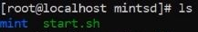

.. |image18| image:: media/image19.JPG
   :width: 2.74783in
   :height: 0.88358in

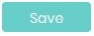

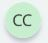

.. |image66| image:: media/image62.jpeg
   :width: 0.35849in
   :height: 0.16241in

.. |image93| image:: media/image87.JPG
   :width: 0.47761in
   :height: 0.14995in

.. |image111| image:: media/image99.JPG
   :width: 3.27522in
   :height: 3.21875in

.. |image113| image:: media/image87.JPG
   :width: 0.47761in
   :height: 0.14995in

.. |image120| image:: media/image62.jpeg
   :width: 0.34416in
   :height: 0.15592in

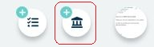

.. |image133| image:: media/image87.JPG
   :width: 0.56604in
   :height: 0.17771in

.. |image139| image:: media/image119.JPG
   :width: 1.37500in
   :height: 0.58477in

.. |image141| image:: media/image121.png
   :width: 6.30833in
   :height: 1.48750in

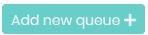

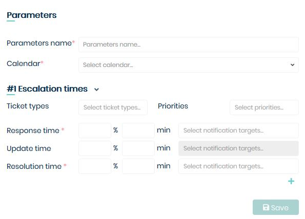

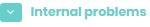

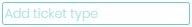

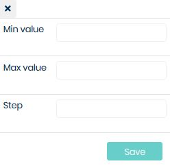

.. |image241| image:: media/image194.JPG
   :width: 0.15951in
   :height: 0.16711in

.. |image248| image:: media/image201.JPG
   :width: 2.01075in
   :height: 0.73235in

.. |image250| image:: media/image202.jpeg
   :width: 6.30833in
   :height: 0.59722in
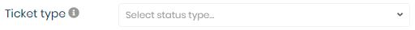

.. |image295| image:: media/image87.JPG
   :width: 0.56604in
   :height: 0.17771in

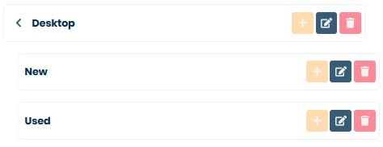

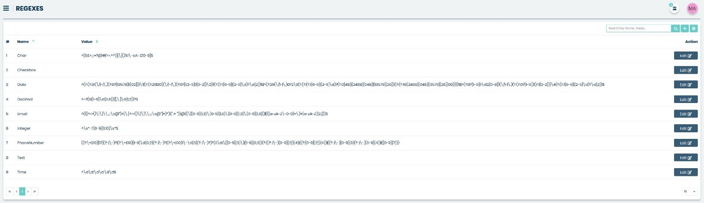

.. |image332| image:: media/image261.jpeg
   :width: 6.30833in
   :height: 1.67222in

.. |image341| image:: media/image266.JPG
   :width: 3.99563in
   :height: 1.12756in
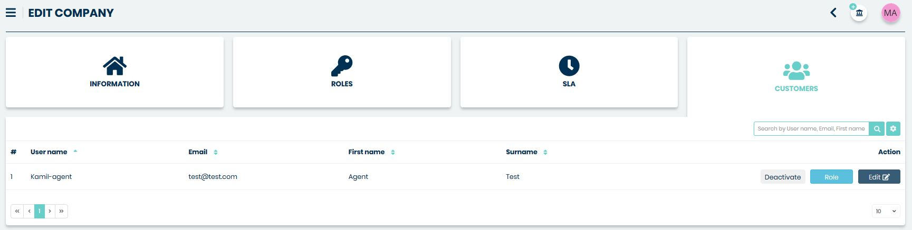

.. |image353| image:: media/image277.JPG
   :width: 5.20755in
   :height: 3.04462in

.. |image360| image:: media/image283.JPG
   :width: 0.53750in
   :height: 0.20673in

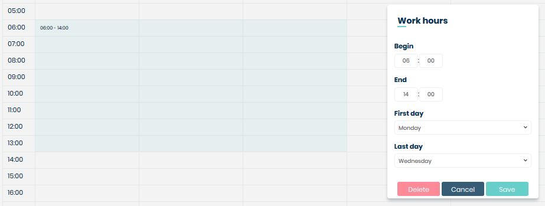

.. |image368| image:: media/image290.JPG
   :width: 2.03445in
   :height: 0.81203in

.. |image382| image:: media/image297.JPG
   :width: 6.30833in
   :height: 2.73125in

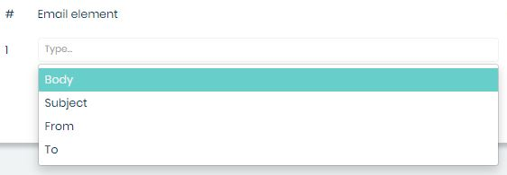

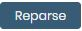

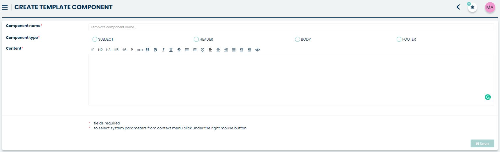

.. |image442| image:: media/image335.jpeg
   :width: 6.30833in
   :height: 1.13056in

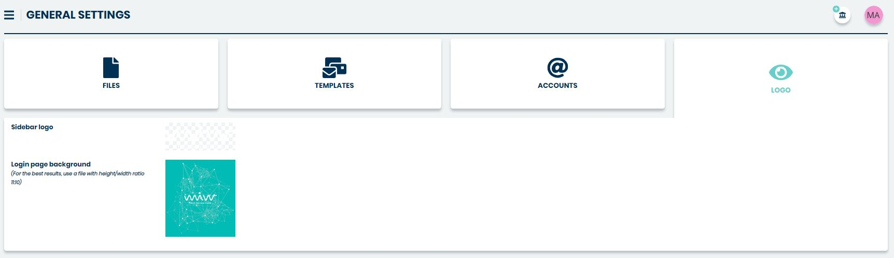

.. |image476| image:: media/image363.JPG
   :width: 0.16204in
   :height: 0.17014in

